# Diagrama de casos de uso CU1-CU18

## Uso previsto en Word

Este artefacto complementa la sección `2.1 FT: Captura de Requisitos`. Para insertarlo en Word, renderizar el bloque Mermaid como imagen y ubicarlo después de la identificación de actores y casos de uso. El diagrama agrupa los casos de uso por paquetes funcionales dentro de la frontera del sistema **Diagramador colaborativo UML 2.5**.

> Restricciones que deben conservarse al copiar el contenido: la colaboración vigente es HTTP + SSE, no WebSocket; XMI es parcial y no lossless; Qwen, S3 y Floci son opt-in; `X-User-Id` es bootstrap de desarrollo/integración, no autenticación productiva.

## Diagrama Mermaid

```mermaid
flowchart LR
  UA[Usuario autenticado]
  UD[Usuario demo]
  AP[Propietario / administrador de proyecto]
  AD[Administrador de diagrama]
  MC[Modelador / colaborador]
  CW[Cliente web]
  CM[Cliente móvil]
  ASR[Servicio ASR local]
  QW[Integración Qwen / extractor fotográfico]
  GEN[Generador]
  OP[Operador técnico / evaluador]

  subgraph SYS[Diagramador colaborativo UML 2.5]
    subgraph P1[Identidad y proyectos]
      CU1((CU1\nAutenticarse y gestionar sesión))
      CU2((CU2\nCrear, listar y recuperar proyectos/versiones))
    end

    subgraph P2[Permisos y administración]
      CU3((CU3\nGestionar permisos de proyecto))
      CU4((CU4\nCrear diagramas y administrar permisos de diagrama))
    end

    subgraph P3[Modelado UML y layout]
      CU5((CU5\nEditar estado semántico UML 2.5))
      CU6((CU6\nEditar layout, geometría y atajos web))
    end

    subgraph P4[Propuestas multimodales]
      CU7((CU7\nCrear propuestas desde texto y revisar decisión))
      CU8((CU8\nTranscribir voz local y convertirla en propuesta))
      CU9((CU9\nCrear propuesta desde foto/Qwen y revisarla))
    end

    subgraph P5[Colaboración y sincronización]
      CU10((CU10\nSincronizar comandos, snapshots y eventos SSE))
      CU11((CU11\nPublicar y visualizar presencia))
      CU12((CU12\nListar, consultar y resolver conflictos))
      CU13((CU13\nConsumir desde móvil descriptor-driven con cola offline))
    end

    subgraph P6[Intercambio, generación y operación]
      CU14((CU14\nImportar/exportar XMI con preview/confirmación))
      CU15((CU15\nGestionar generación determinista y artefactos))
      CU16((CU16\nGestionar deployments))
      CU17((CU17\nConsultar salud, ejecutar comandos y conservar evidencia))
      CU18((CU18\nConfigurar almacenamiento local/S3/Floci))
    end
  end

  UA --- CU1
  UD --- CU1
  UA --- CU2
  AP --- CU3
  AD --- CU4
  MC --- CU4
  MC --- CU5
  MC --- CU6
  CW --- CU6
  MC --- CU7
  MC --- CU8
  ASR --- CU8
  MC --- CU9
  QW --- CU9
  CW --- CU10
  CM --- CU10
  MC --- CU10
  MC --- CU11
  CW --- CU11
  CM --- CU11
  MC --- CU12
  CM --- CU12
  CM --- CU13
  MC --- CU14
  MC --- CU15
  GEN --- CU15
  OP --- CU16
  MC --- CU16
  OP --- CU17
  OP --- CU18

  CU8 -. <<include>> alimenta propuesta revisable .-> CU7
  CU9 -. <<include>> alimenta propuesta revisable .-> CU7
  CU13 -. <<include>> usa sincronización .-> CU10
  CU13 -. <<extend>> puede derivar en conflictos .-> CU12
  CU11 -. <<include>> se distribuye por SSE .-> CU10
  CU15 -. <<include>> almacena artefactos según configuración .-> CU18
  CU14 -. <<extend>> requiere confirmación ante pérdidas .-> CU5
  CU1 -. habilita acceso protegido .-> CU2
  CU1 -. habilita acceso protegido .-> CU3
  CU1 -. habilita acceso protegido .-> CU4
```

## Tabla actor -> casos de uso

| Actor | Casos de uso asociados |
|---|---|
| Usuario autenticado | CU1, CU2 |
| Usuario demo | CU1 |
| Propietario o administrador de proyecto | CU3 |
| Administrador de diagrama | CU4 |
| Modelador / colaborador | CU4, CU5, CU6, CU7, CU8, CU9, CU10, CU11, CU12, CU14, CU15, CU16 |
| Cliente web | CU6, CU10, CU11 |
| Cliente móvil | CU10, CU11, CU12, CU13 |
| Servicio ASR local | CU8 |
| Integración Qwen / extractor fotográfico | CU9 |
| Generador | CU15 |
| Operador técnico / evaluador | CU16, CU17, CU18 |

## Notas de relaciones

- **CU1 habilita operaciones protegidas**, pero `X-User-Id` no se modela como autenticación productiva; sólo representa bootstrap de desarrollo/integración.
- **CU5 y CU6 se separan** porque el sistema distingue estado semántico UML y layout visual.
- **CU10 incluye el mecanismo colaborativo vigente** mediante comandos HTTP y eventos SSE (`text/event-stream`); no se debe documentar WebSocket como transporte actual.
- **CU8 y CU9 incluyen CU7 conceptualmente**: voz y fotografía/Qwen producen entradas candidatas que deben pasar por propuestas revisables antes de modificar el modelo.
- **CU13 incluye CU10 y puede extender CU12**: el móvil usa sincronización y su cola offline puede producir conflictos que requieren resolución explícita.
- **CU11 depende del stream de CU10** para distribuir presencia, pero presencia no sustituye el estado semántico.
- **CU14 extiende el modelado con intercambio XMI** y requiere preview/confirmación porque el roundtrip no es lossless.
- **CU15 incluye CU18 cuando hay artefactos persistidos**: PostgreSQL es el modo base; S3/Floci son configuraciones opt-in y Floci no demuestra AWS real.
- **Qwen/fotografía, S3 y Floci son opt-in**; la existencia de configuración o endpoints no equivale a disponibilidad productiva universal.
