# Modelo de casos de uso

## 1. Identificar actores

El sistema objeto de estudio es un diagramador colaborativo de clases UML 2.5. Según la guía técnica del proyecto, el límite del sistema comprende las superficies web y móvil, la gestión de proyectos y permisos, la edición semántica y visual del modelo, la sincronización colaborativa mediante HTTP y SSE, las propuestas multimodales, el intercambio XMI, la generación de artefactos y las operaciones técnicas asociadas.

Los actores se identifican a partir de las responsabilidades observables en la guía y en el catálogo corregido de casos de uso.

| Actor | Tipo | Descripción académica |
|---|---|---|
| Usuario autenticado | Primario | Persona que inicia sesión y opera proyectos visibles de acuerdo con sus permisos. |
| Usuario demo | Primario especializado | Usuario que accede mediante login de demostración cuando la configuración de usuarios demo está habilitada. |
| Propietario o administrador de proyecto | Primario | Responsable de administrar miembros, invitaciones, capacidades e historial de permisos del proyecto. |
| Administrador de diagrama | Primario | Responsable de configurar la colaboración, los colaboradores, el administrador y el acceso efectivo de una vista o diagrama. |
| Modelador / colaborador | Primario | Usuario que crea y modifica el modelo UML, el layout, propuestas, presencia y resolución de conflictos. |
| Cliente web | Secundario / interfaz | Aplicación web que consume comandos HTTP, snapshots y eventos SSE para operar el sistema. |
| Cliente móvil | Secundario / interfaz | Aplicación Flutter descriptor-driven que opera capacidades del modelo y administra una cola offline. |
| Servicio ASR local | Secundario externo | Servicio local que transcribe audio en español (`es-ES`) para alimentar propuestas revisables. |
| Integración Qwen / extractor fotográfico | Secundario externo | Componente configurable y opt-in que extrae propuestas candidatas desde imágenes. |
| Generador | Secundario interno | Componente que produce artefactos deterministas a partir del modelo y sus perfiles de generación. |
| Operador técnico / evaluador | Primario técnico | Actor que verifica salud, ejecuta comandos, conserva evidencia, gestiona deployments y configura almacenamiento. |

## 2. Identificar casos de uso

La identificación de casos de uso se toma del catálogo corregido `CASOS_USO_MVP.md`, derivado de `GUIA DEL PROYECTO.txt`. Se conserva el conjunto completo de dieciocho casos de uso, sin reducirlo al listado anterior CU1-CU12.

| Código | Caso de uso | Actor principal | Propósito |
|---|---|---|---|
| CU1 | Autenticarse y gestionar sesión | Usuario autenticado / demo | Acceder, cerrar sesión y usar login demo bajo configuración explícita. |
| CU2 | Crear, listar y recuperar proyectos/versiones | Usuario autenticado | Crear proyectos, consultar proyectos visibles y recuperar modelos o revisiones. |
| CU3 | Gestionar permisos, invitaciones, miembros y capacidades de proyecto | Administrador de proyecto | Controlar participación, capacidades e historial de permisos del proyecto. |
| CU4 | Crear diagramas/vistas y administrar permisos de diagrama | Administrador de diagrama | Crear vistas y administrar colaboración, acceso e historial de permisos. |
| CU5 | Editar estado semántico UML 2.5 | Modelador / colaborador | Modificar clases, atributos, operaciones, relaciones y extremos. |
| CU6 | Editar layout, geometría y usar atajos web | Modelador / cliente web | Modificar presentación visual sin alterar la semántica UML. |
| CU7 | Crear propuestas desde texto y revisar decisión | Modelador | Registrar propuestas textuales y aceptarlas o descartarlas explícitamente. |
| CU8 | Transcribir voz local y convertirla en propuesta | Modelador / ASR local | Convertir audio local en texto para propuestas revisables. |
| CU9 | Crear propuesta desde foto/Qwen y revisarla | Modelador / integración Qwen | Extraer candidatos desde imágenes mediante integración configurable y revisable. |
| CU10 | Sincronizar comandos, snapshots y eventos SSE | Cliente web / móvil | Enviar operaciones, recuperar snapshots y recibir eventos por SSE. |
| CU11 | Publicar y visualizar presencia | Colaborador | Informar actividad de participantes sin modificar el estado del modelo. |
| CU12 | Listar, consultar y resolver conflictos | Colaborador | Gestionar conflictos de sincronización de manera explícita. |
| CU13 | Consumir desde móvil descriptor-driven con cola offline | Cliente móvil | Operar desde Flutter con descriptores y tolerancia a desconexión. |
| CU14 | Importar/exportar XMI con preview/confirmación | Modelador | Intercambiar modelos por XMI con revisión previa y limitaciones declaradas. |
| CU15 | Gestionar generación determinista, targets, perfiles, runs y artefactos | Modelador / generador | Ejecutar generación y descargar artefactos asociados al run. |
| CU16 | Gestionar deployments | Operador técnico | Crear, consultar, actualizar, habilitar, deshabilitar o eliminar deployments. |
| CU17 | Consultar salud, ejecutar comandos y conservar evidencia | Operador técnico / evaluador | Verificar salud, ejecutar pruebas y conservar evidencia técnica. |
| CU18 | Configurar almacenamiento local/S3/Floci para artefactos | Operador técnico | Configurar el almacenamiento de artefactos, con S3/Floci sólo como opt-in. |

## 3. Priorizar casos de uso

La priorización combina valor funcional, dependencia técnica y estado documentado en la guía. No debe interpretarse como exclusión de los casos no críticos; todos los CU forman parte del catálogo derivado de la guía.

| Prioridad / estado | Casos de uso | Justificación |
|---|---|---|
| MVP-crítico | CU1, CU2, CU5, CU6, CU10, CU15 | Constituyen la ruta central: acceso, proyecto, edición UML, layout, colaboración y generación de artefactos. |
| Requerido por guía | CU3, CU4, CU7, CU11, CU12, CU13, CU16, CU17 | La guía documenta estas superficies como parte del producto, aunque algunas no sean la ruta mínima de edición. |
| Opcional / opt-in / integración | CU8, CU9, CU18 | Dependen de servicios o configuración explícita: ASR local, Qwen/fotografía y almacenamiento S3/Floci. |
| Limitación conocida / issue abierto | CU14 | XMI existe con preview, confirmación y exportación, pero el roundtrip no es completo ni lossless. |

## 4. Estructurar modelo de casos de uso

El modelo se organiza por límites funcionales del sistema. Esta estructura facilita su traslado a un documento académico PUDS: primero se muestran actores y subsistemas, luego se detallan las relaciones funcionales.

### 4.1 Representación textual UML

La siguiente representación puede copiarse como Mermaid. Agrupa los casos por frontera del sistema y usa actores externos para servicios opt-in o técnicos.

```mermaid
flowchart LR
  usuario["Usuario autenticado"]
  demo["Usuario demo"]
  adminProyecto["Propietario / administrador de proyecto"]
  adminDiagrama["Administrador de diagrama"]
  modelador["Modelador / colaborador"]
  web["Cliente web"]
  movil["Cliente móvil"]
  asr["Servicio ASR local"]
  qwen["Integración Qwen / extractor fotográfico"]
  generador["Generador"]
  operador["Operador técnico / evaluador"]

  subgraph S["Sistema: Diagramador colaborativo UML 2.5"]
    subgraph Identidad["Identidad y proyectos"]
      CU1(("CU1 Autenticarse y gestionar sesión"))
      CU2(("CU2 Crear, listar y recuperar proyectos/versiones"))
    end

    subgraph Permisos["Permisos y administración"]
      CU3(("CU3 Gestionar permisos de proyecto"))
      CU4(("CU4 Crear diagramas/vistas y administrar permisos"))
    end

    subgraph Modelado["Modelado UML y layout"]
      CU5(("CU5 Editar estado semántico UML 2.5"))
      CU6(("CU6 Editar layout, geometría y atajos web"))
    end

    subgraph Propuestas["Propuestas multimodales"]
      CU7(("CU7 Crear propuestas desde texto y revisar"))
      CU8(("CU8 Transcribir voz y convertir en propuesta"))
      CU9(("CU9 Crear propuesta desde foto/Qwen y revisar"))
    end

    subgraph Colaboracion["Colaboración y sincronización"]
      CU10(("CU10 Sincronizar comandos, snapshots y eventos SSE"))
      CU11(("CU11 Publicar y visualizar presencia"))
      CU12(("CU12 Listar, consultar y resolver conflictos"))
      CU13(("CU13 Consumir desde móvil con cola offline"))
    end

    subgraph Intercambio["Intercambio, generación y operación"]
      CU14(("CU14 Importar/exportar XMI con preview/confirmación"))
      CU15(("CU15 Gestionar generación determinista y artefactos"))
      CU16(("CU16 Gestionar deployments"))
      CU17(("CU17 Consultar salud, ejecutar comandos y conservar evidencia"))
      CU18(("CU18 Configurar almacenamiento local/S3/Floci"))
    end
  end

  usuario --- CU1
  demo --- CU1
  usuario --- CU2
  adminProyecto --- CU3
  adminDiagrama --- CU4
  modelador --- CU5
  modelador --- CU6
  web --- CU6
  modelador --- CU7
  modelador --- CU8
  asr --- CU8
  modelador --- CU9
  qwen --- CU9
  web --- CU10
  movil --- CU10
  modelador --- CU11
  web --- CU11
  movil --- CU11
  modelador --- CU12
  movil --- CU12
  movil --- CU13
  modelador --- CU14
  modelador --- CU15
  generador --- CU15
  operador --- CU16
  operador --- CU17
  operador --- CU18

  CU8 -. "alimenta" .-> CU7
  CU9 -. "alimenta" .-> CU7
  CU13 -. "usa" .-> CU10
  CU13 -. "puede derivar en" .-> CU12
  CU15 -. "requiere almacenamiento" .-> CU18
```

### 4.2 Relaciones funcionales relevantes

- CU1 habilita el acceso a proyectos y operaciones protegidas, pero `X-User-Id` se considera únicamente una identidad de bootstrap de desarrollo o integración, no autenticación productiva.
- CU5 y CU6 se mantienen separados porque la guía diferencia el estado semántico UML del layout visual.
- CU10 coordina la colaboración mediante comandos HTTP, snapshots y eventos SSE; no se documenta WebSocket como transporte vigente.
- CU8 y CU9 alimentan propuestas revisables; no aplican cambios directamente al modelo.
- CU13 utiliza sincronización y puede derivar en conflictos; la cola offline no equivale a confirmación automática.
- CU14 declara la limitación XMI: el intercambio no es lossless y Q9 permanece abierto.
- CU18 soporta el almacenamiento de artefactos: PostgreSQL por defecto, S3/Floci sólo como configuración opt-in.

## 5. Especificación resumida de casos de uso

La siguiente especificación resume los casos para incorporación en la sección de requisitos. Las descripciones completas permanecen en el catálogo `CASOS_USO_MVP.md`.

| CU | Objetivo | Precondición principal | Flujo resumido | Resultado esperado |
|---|---|---|---|---|
| CU1 | Gestionar sesión. | Backend disponible; usuarios demo sembrados si se usa demo-login. | El usuario inicia sesión, opera según permisos y cierra sesión. | Sesión válida o rechazo explícito; demo-login condicionado por configuración. |
| CU2 | Gestionar proyectos y versiones. | Usuario identificado con visibilidad. | Crear proyecto, listar visibles, abrir modelo, consultar versiones y revisión. | Proyecto/modelo recuperable con historial de revisiones. |
| CU3 | Administrar permisos de proyecto. | Proyecto existente y actor autorizado. | Gestionar invitaciones, miembros, capacidades e historial. | Acceso controlado y auditable por proyecto. |
| CU4 | Administrar diagramas/vistas. | Proyecto existente y capacidad suficiente. | Crear vista, configurar colaboración, colaboradores, administrador e historial. | Vista creada y permisos efectivos consultables. |
| CU5 | Editar semántica UML. | Proyecto/modelo abierto y permiso de edición. | Crear o modificar clases, atributos, operaciones, relaciones y extremos. | Estado semántico persistente, versionable y sincronizable. |
| CU6 | Editar layout visual. | Vista abierta con elementos editables. | Mover nodos/rutas y usar atajos web aplicables. | Layout persistente sin alterar la semántica UML. |
| CU7 | Gestionar propuestas textuales. | Proyecto existente; función habilitada si se espera IA activa. | Crear propuesta, consultar revisión y decidir aceptar o descartar. | Propuesta trazable; cambios sólo tras decisión explícita. |
| CU8 | Usar voz local como entrada. | ASR local disponible, audio `es-ES` y hasta 25 MiB. | Transcribir audio y usar texto como propuesta revisable. | Texto obtenido o error controlado; cambio sujeto a revisión. |
| CU9 | Usar foto/Qwen como entrada. | Integración fotográfica/Qwen habilitada explícitamente. | Subir imagen, extraer candidato, revisar y decidir. | Propuesta candidata sin aplicación automática. |
| CU10 | Sincronizar colaboración. | Proyecto/modelo conocido por el cliente. | Enviar comandos, recuperar snapshots y consumir eventos SSE. | Estado sincronizado mediante HTTP+SSE dentro del alcance medido. |
| CU11 | Gestionar presencia. | Proyecto/modelo abierto. | Publicar presencia y recibirla por stream de eventos. | Actividad visible sin modificar estado semántico ni layout. |
| CU12 | Resolver conflictos. | Operaciones concurrentes u offline pendientes. | Listar conflicto, consultarlo, decidir y registrar resolución. | Conflicto resuelto explícitamente o conservado si la resolución es inválida. |
| CU13 | Operar desde móvil. | Aplicación Flutter y backend configurables. | Renderizar capacidades por descriptor, encolar offline y sincronizar al reconectar. | Operación móvil tolerante a desconexión, con conflictos tratados por CU12. |
| CU14 | Intercambiar XMI. | Modelo o archivo XMI disponible. | Exportar o importar con preview y confirmación. | Intercambio parcial documentado; no se promete roundtrip lossless. |
| CU15 | Generar artefactos. | Modelo, target y perfil disponibles. | Crear/listar targets, consultar perfiles, ejecutar generación y descargar artefactos. | Artefactos asociados al run; determinismo limitado a evidencia disponible. |
| CU16 | Gestionar deployments. | Proyecto existente y actor autorizado. | Crear, listar, consultar, actualizar, habilitar, deshabilitar o eliminar deployment. | Estado de deployment observable y modificable. |
| CU17 | Verificar salud y evidencia. | Entorno técnico disponible. | Consultar health, ejecutar comandos documentados y conservar reportes. | Evidencia técnica diferenciada de supuestos o diseño previsto. |
| CU18 | Configurar almacenamiento. | Generación de artefactos habilitada. | Usar PostgreSQL por defecto o configurar S3/Floci opt-in. | Almacenamiento explícito; Floci no implica AWS real. |

## 6. Trazabilidad guía -> CU

La trazabilidad vincula cada superficie de la guía con los casos de uso que la cubren. Esta tabla permite justificar que el modelo no omite funcionalidades documentadas por la fuente autoridad.

| Sección o superficie de `GUIA DEL PROYECTO.txt` | Casos de uso relacionados |
|---|---|
| Resumen y arquitectura general | CU2, CU5, CU6, CU10, CU13, CU15 |
| Estado conocido del producto | CU8, CU9, CU10, CU11, CU13, CU14, CU15, CU18 |
| Backend, modelo y migraciones | CU2, CU3, CU4, CU5, CU10, CU11, CU12, CU14, CU15, CU16, CU18 |
| Variables de configuración | CU1, CU7, CU8, CU9, CU13, CU15, CU18 |
| API de autenticación | CU1 |
| API de proyectos y recuperación | CU2 |
| API de permisos del proyecto | CU3 |
| API de permisos del diagrama | CU4 |
| API de propuestas y revisión | CU7, CU8, CU9 |
| API de sincronización, conflictos y presencia | CU10, CU11, CU12, CU13 |
| API XMI | CU14 |
| API de generación | CU15 |
| API de deployments | CU16 |
| API de salud | CU17 |
| Autenticación y seguridad | CU1, CU3, CU4, CU9, CU18 |
| IA: texto, voz, fotografía y Qwen | CU7, CU8, CU9 |
| Contrato ASR local | CU8 |
| Web y atajos | CU5, CU6, CU10, CU11, CU12 |
| Móvil Flutter descriptor-driven y offline | CU13, CU10, CU12 |
| Colaboración, presencia y sincronización | CU10, CU11, CU12 |
| XMI y evidencia de roundtrip | CU14 |
| Generación determinista | CU15 |
| Despliegue y servicios | CU16, CU17, CU18 |
| Pruebas y evidencia | CU10, CU11, CU14, CU15, CU17 |
| Limitaciones y riesgos conocidos | CU1, CU7, CU8, CU9, CU10, CU14, CU15, CU18 |

## Notas de alcance y restricciones

- El transporte vigente de colaboración es HTTP más SSE/eventos; no se afirma uso actual de WebSocket.
- XMI se documenta como parcial y no lossless.
- Qwen, fotografía, S3 y Floci son integraciones opt-in; su configuración no demuestra disponibilidad universal del servicio externo.
- `X-User-Id` no se presenta como autenticación de producción.
- La evidencia de generación determinista corresponde a ejecuciones medidas concretas y no prueba todos los modelos, targets o perfiles.
